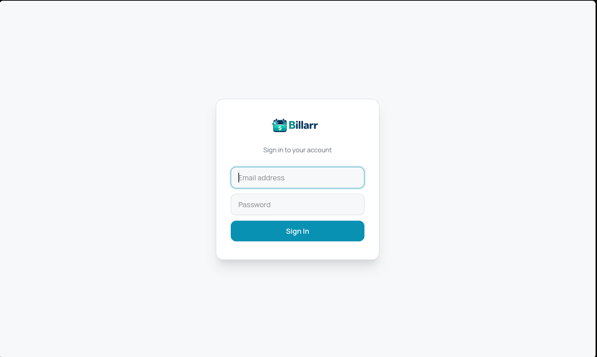
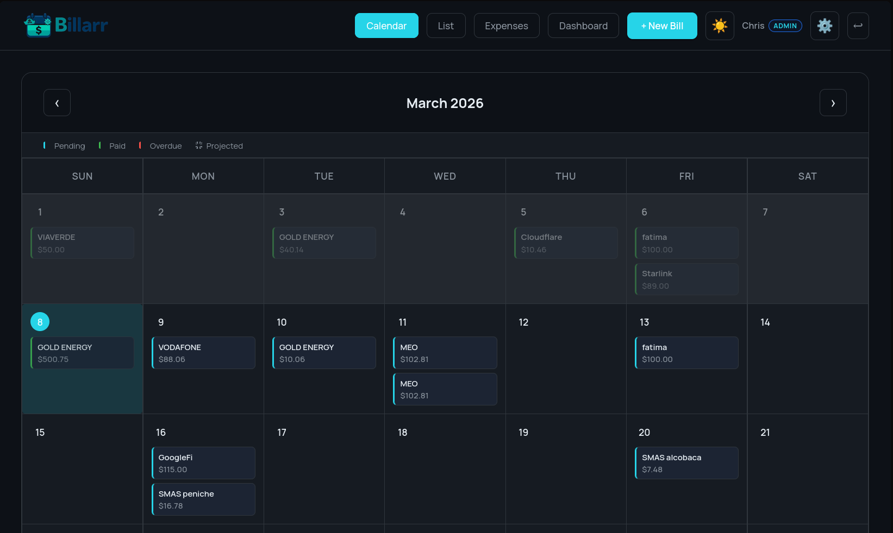
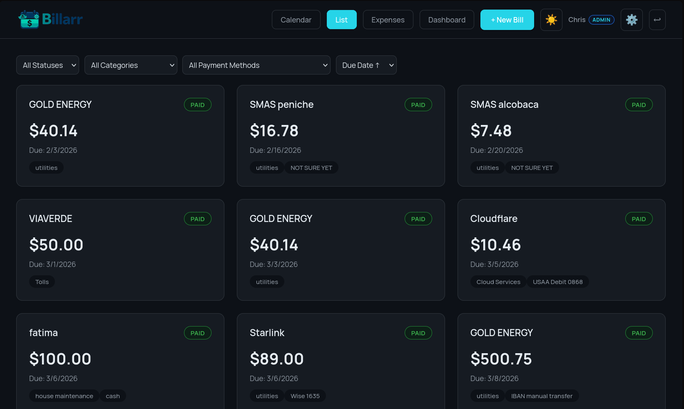
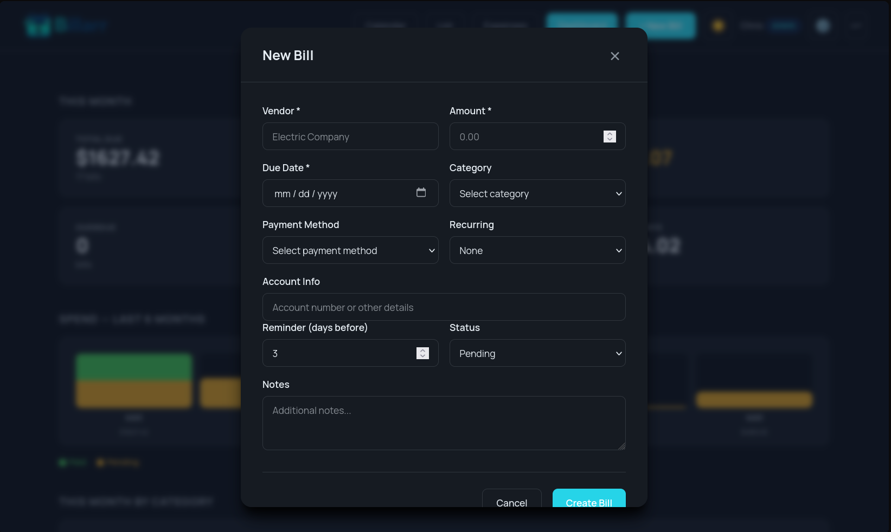
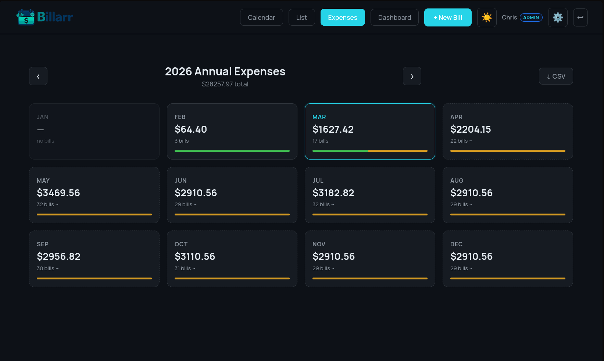
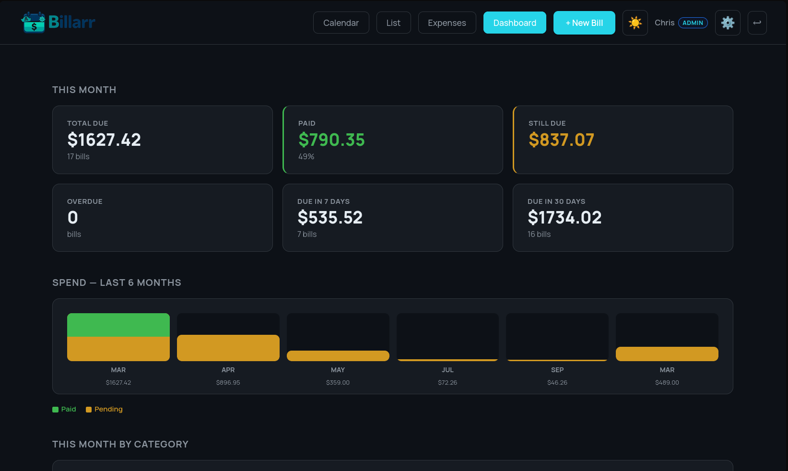
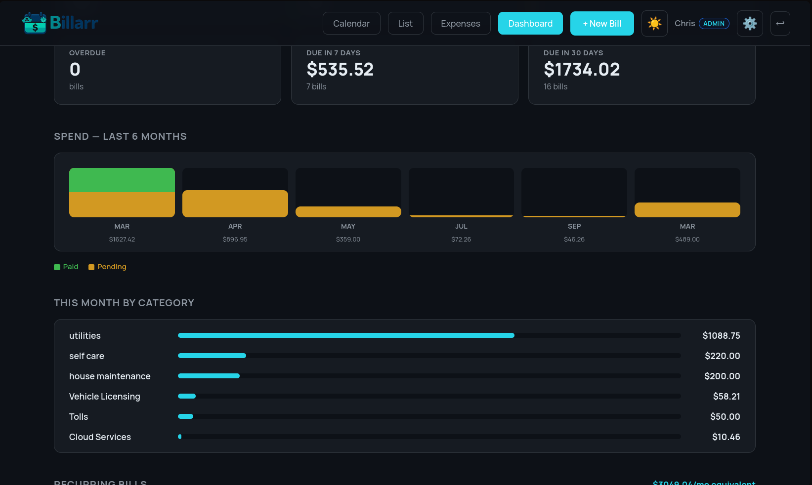
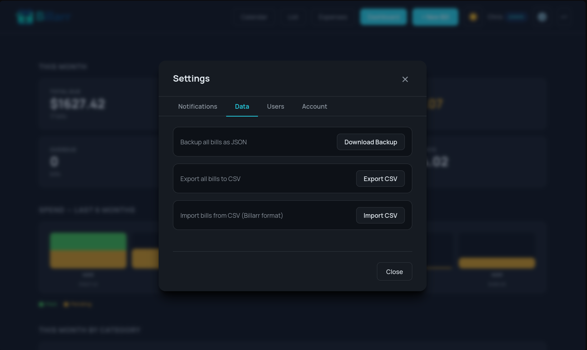

<div align="center">

# ⚓ Billarr


**Self-hosted bill and subscription tracker for the self-hosted community**

*Never walk the plank of late fees again!* 🏴‍☠️💰

[](https://www.docker.com/)
[](https://reactjs.org/)
[](https://nodejs.org/)
[](https://opensource.org/licenses/MIT)

[Features](#-features) • [Quick Start](#-quick-start) • [Authentication](#-authentication) • [Documentation](#-documentation) • [Contributing](#-contributing)

</div>

---

## 🎯 What is Billarr?

Billarr is a self-hosted bill tracking and subscription management application designed for the self-hosted community. Track recurring bills, visualise spending trends, get reminders before payments are due, and keep your financial data on your own server — no subscriptions, no cloud, no tracking.

Inspired by the naming and aesthetic of the \*arr ecosystem.

### Why Billarr?

- 🔒 **Privacy First** — your financial data stays on your server, full stop
- 📊 **Actual Insights** — spending dashboard, category breakdowns, price change history
- 🔄 **Subscription Aware** — normalised monthly cost for weekly/quarterly/annual bills
- 🔔 **Smart Reminders** — Telegram push notifications + Google Calendar sync
- 🐳 **Easy Deploy** — one Docker Compose command, pre-built images
- 🌗 **Light & Dark** — clean modern UI with theme toggle
- 👥 **Multi-User** — JWT user accounts with admin/member roles

---

## 📸 Screenshots

<div align="center">

| Login | Calendar |
|---|---|
| [](Screenshots/BillarrLogin.png) | [](Screenshots/BillarrCalendarView.png) |

| List View | Bill Entry |
|---|---|
| [](Screenshots/BillarrListView.png) | [](Screenshots/BIllarBillEntryView.png) |

| Expenses View | Reports / Dashboard |
|---|---|
| [](Screenshots/BillarrExpensesView.png) | [](Screenshots/BillarrReportsView.png) |

| Reports Expanded | Settings |
|---|---|
| [](Screenshots/BillarrReportsExpanded.png) | [](Screenshots/BillarrSettingsView.png) |

</div>

---

## ✨ Features

### 📅 Bill Management

- **Calendar View** — all bills at a glance, colour-coded by status; recurring bills projected into future months
- **List View** — filterable card view by status, category, or payment method
- **Expenses View** — annual 12-month grid with recurring projections, paid/pending status bars, and per-month drill-down with CSV export
- **Detailed Tracking** — vendor, amount, due date, payment method, account info, category, notes
- **Categories & Payment Methods** — fully dynamic; create new ones inline from the bill form
- **Vendor Autocomplete** — picks from your past vendors as you type
- **Recurring Bills** — weekly, monthly, quarterly, or annual; auto-creates the next bill when you mark one paid
- **Status Tracking** — pending, paid, overdue

### 📊 Dashboard & Reporting

- **Summary Cards** — this month's total, paid, still due, overdue count, upcoming in 7 and 30 days
- **6-Month Spend Bars** — visual trend showing paid vs pending split per month, no chart libraries required
- **Category Breakdown** — proportional bar chart for the current month's spend
- **Subscription Table** — all recurring bills with normalised monthly-equivalent cost, auto-renew status, and cancellation URL
- **Price Change History** — automatically records when a bill's amount changes; shows diff and percentage

### 🔄 Subscription Management

- Mark any recurring bill with **auto-renew** on/off
- Store a **cancellation URL** per subscription — linked directly from the dashboard
- **Monthly equivalent** normalisation: a \$120/year bill shows as \$10/month; a \$25/week bill shows as ~\$108/month
- Subscriptions sorted by monthly equivalent so you can see your biggest recurring costs at a glance

### 🔔 Notifications

- **Telegram** — instant push notifications to your phone or group
- **Google Calendar** — bills synced as calendar events with configurable reminders
- **Smart Scheduler** — checks every 30 minutes; notifies within each bill's reminder window
- **Per-bill Reminder Days** — set 0–30 days lead time individually per bill

### 💾 Data Management

- **Auto Backup** — timestamped JSON snapshot written to `./data/` before every database migration
- **Manual Backup** — download a full JSON backup any time from Settings (admin only)
- **CSV Export** — export all bills or an annual expenses view to CSV
- **CSV Import** — bulk-import from a Billarr-format CSV (admin only)

### 🔧 Technical

- **Self-Hosted** — SQLite database, bind-mounted `./data/` directory, zero cloud dependencies
- **Pre-built Docker Images** — pull from `ghcr.io`, no local build required
- **Automatic Migrations** — schema updates run on startup; a backup is written before each migration run
- **RESTful API** — clean Express backend; all business logic in a service layer, routes are 3–6 lines each
- **Rate Limiting** — 300 req/15 min on all API routes; separate stricter limits on auth and notification trigger endpoints
- **No Tracking** — zero analytics, no third-party beacons, no telemetry

---

## 🚀 Quick Start

### Prerequisites

- Docker and Docker Compose

### Installation (pre-built images — recommended)

Create a `docker-compose.yml`:

```yaml
services:
  backend:
    image: ghcr.io/sovereignalmida/billarr-backend:latest
    container_name: billarr-backend
    volumes:
      - ./data:/app/data
    environment:
      - NODE_ENV=production
      - PORT=3001
      - DB_PATH=/app/data/bills.db
      # Auth — choose one mode (see Authentication section below):
      # - JWT_SECRET=change-this-to-a-long-random-string   # recommended
      # - BILLARR_PASSWORD=changeme                        # legacy single-password
    restart: unless-stopped

  frontend:
    image: ghcr.io/sovereignalmida/billarr-frontend:latest
    container_name: billarr-frontend
    ports:
      - "8080:80"
    depends_on:
      - backend
    restart: unless-stopped
```

```bash
docker compose pull
docker compose up -d
# Open http://localhost:8080
```

No cloning, no building. 🎉

### Updating

```bash
docker compose pull && docker compose up -d
```

Migrations run automatically on startup. Your `./data/` is backed up to a timestamped JSON file before any schema change.

### Build from source

```bash
git clone https://github.com/sovereignalmida/billarr.git
cd billarr
cp docker-compose.example.yml docker-compose.yml
# Swap image: lines for build: lines in the compose file
docker compose up -d --build
```

---

## 🔐 Authentication

Billarr supports three modes. Pick one and set it in your `docker-compose.yml` environment.

### Mode 1: JWT user accounts (recommended)

Full user management with admin/member roles. Recommended for any instance accessible beyond your local machine.

```yaml
environment:
  - JWT_SECRET=change-this-to-a-long-random-string
```

> Generate a strong secret: `openssl rand -hex 32`

**First-run setup:**

1. Open Billarr — a first-run setup screen appears automatically when no users exist yet
2. Enter your name, email address, and a password (minimum 8 characters)
3. Your account is created as **admin**
4. Log in and start tracking

**Adding more users** (admin only):

Go to **Settings → User Management → Add User**. Assign `admin` or `member`:

| Role | Permissions |
|---|---|
| **admin** | Full access — bills, settings, users, backup, import/export |
| **member** | View and manage bills only; no settings or user management |

**Changing your password:** Settings → Account → Change Password.

### Mode 2: Single password (legacy)

One shared password for the whole instance. Simpler, but no roles or per-user accounts.

```yaml
environment:
  - BILLARR_PASSWORD=changeme
```

The browser stores it in `sessionStorage` and prompts again on 401.

### Mode 3: No auth (default)

Leave both variables unset. Anyone with network access can use the app. Only appropriate on a trusted private network.

---

## ⚙️ Configuration

### Environment Variables

| Variable | Default | Description |
|---|---|---|
| `JWT_SECRET` | *(unset)* | Enable JWT user accounts. Set to a long random string. |
| `BILLARR_PASSWORD` | *(unset)* | Enable legacy single-password mode. Ignored if `JWT_SECRET` is set. |
| `PORT` | `3001` | Backend API port |
| `DB_PATH` | `/app/data/bills.db` | SQLite database path inside the container |
| `CORS_ORIGIN` | `http://localhost:8080` | Allowed CORS origin. Set to your frontend's public URL in production. |

### Data Persistence

All data lives in `./data/` on the host — a bind mount, not a Docker volume. This means:

- Data survives `docker compose down`, image updates, and `docker system prune`
- Pre-migration backups are written to `./data/bills-backup-{timestamp}.json` automatically
- Manual backup available any time via **Settings → Data Management → Download Backup** (admin only)

### Ports

- Frontend: `http://localhost:8080`
- Backend API: `http://localhost:3001` (internal; not exposed publicly by default)

---

## 🔔 Setting Up Notifications

### Telegram (5 minutes)

1. Message `@BotFather` on Telegram → `/newbot`
2. Copy the bot token
3. Start a chat with your bot, then get your chat ID from `@userinfobot`
4. Enter both in **Settings → Notifications**

Full guide: [TELEGRAM_SETUP.md](TELEGRAM_SETUP.md)

### Google Calendar (10 minutes)

1. Create a Google Cloud project and enable the Calendar API
2. Create a service account and download the JSON key file
3. Share your calendar with the service account email address
4. Place the key file at `./data/google-credentials.json`
5. Enable sync in **Settings → Google Calendar**

Full guide: [GOOGLE_CALENDAR_SETUP.md](GOOGLE_CALENDAR_SETUP.md)

---

## 📚 Documentation

- **[DEPLOYMENT.md](DEPLOYMENT.md)** — production deployment, HTTPS, Traefik, Nginx, Caddy
- **[NOTIFICATIONS.md](NOTIFICATIONS.md)** — complete notification setup guide
- **[TELEGRAM_SETUP.md](TELEGRAM_SETUP.md)** — Telegram bot configuration step-by-step
- **[GOOGLE_CALENDAR_SETUP.md](GOOGLE_CALENDAR_SETUP.md)** — Google Calendar integration
- **[CONTRIBUTING.md](CONTRIBUTING.md)** — how to contribute

---

## 🛠️ Tech Stack

- **Frontend:** React 18, Manrope font, vanilla CSS with CSS variables, fully responsive
- **Backend:** Node.js 18, Express, SQLite3, service-layer architecture
- **Auth:** JWT (jsonwebtoken + bcryptjs) with admin/member roles; legacy Basic Auth for backward compatibility
- **Notifications:** Telegram Bot API, Google Calendar API
- **Deployment:** Docker, Docker Compose, Nginx

---

## 🤝 Contributing

Contributions are welcome.

- Report bugs via [GitHub Issues](https://github.com/sovereignalmida/billarr/issues)
- Suggest features via [GitHub Discussions](https://github.com/sovereignalmida/billarr/discussions)
- Open an issue before starting major work

See [CONTRIBUTING.md](CONTRIBUTING.md) for guidelines.

---

## 📋 Roadmap

- [x] Calendar and list views
- [x] Recurring bill auto-creation
- [x] Telegram notifications
- [x] Google Calendar sync
- [x] Dark mode
- [x] CSV export / import
- [x] Custom categories and payment methods
- [x] Annual expenses view with projections
- [x] Multi-user accounts with roles (JWT)
- [x] Spending dashboard with trend charts
- [x] Subscription management with monthly-equivalent normalisation
- [x] Price change history tracking
- [ ] Email notifications
- [ ] PWA / add to home screen
- [ ] API webhooks

---

## 🙏 Acknowledgments

- Inspired by the naming and aesthetic of the \*arr self-hosted ecosystem
- Built for and by the self-hosted community

---

## 📄 License

MIT — see [LICENSE](LICENSE) for details.

---

## 💬 Support

- **Issues:** [GitHub Issues](https://github.com/sovereignalmida/billarr/issues)
- **Discussions:** [GitHub Discussions](https://github.com/sovereignalmida/billarr/discussions)

---

<div align="center">

**Made with ❤️ for the self-hosted community**

⚓ *Hoist the sails on your finances* 🏴‍☠️

[⬆ Back to Top](#-billarr)

</div>
